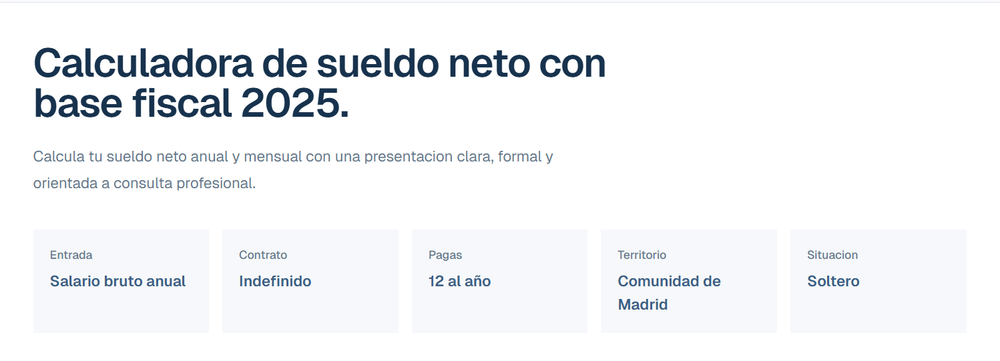
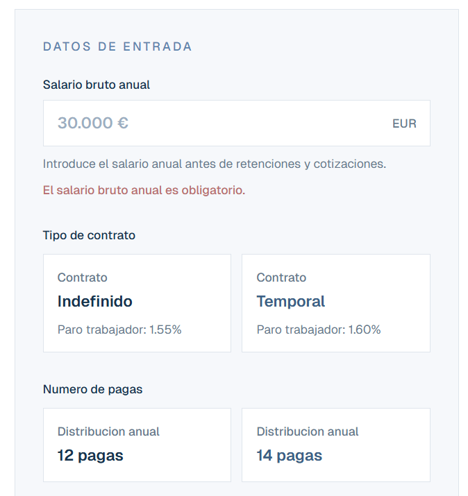
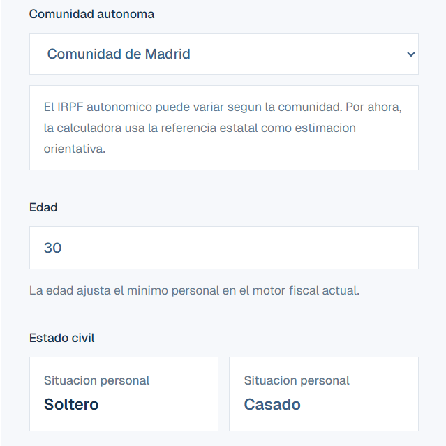
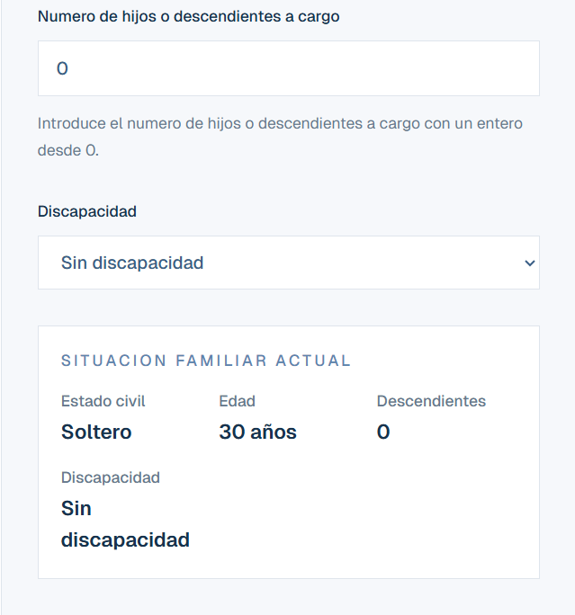
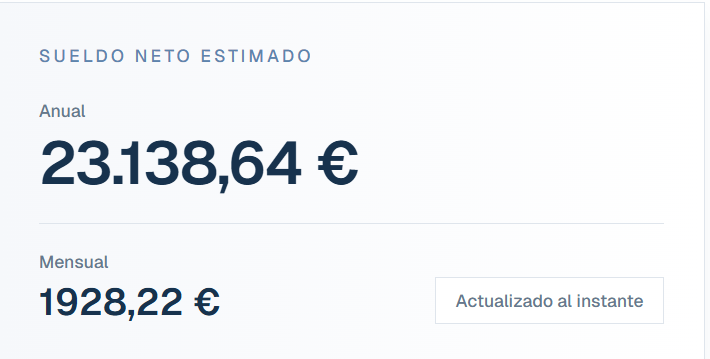
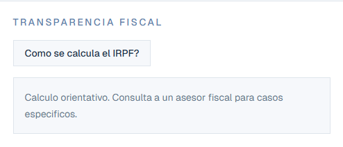

# Calculadora Sueldo Neto 2025

Aplicacion web en Next.js para estimar sueldo neto anual y mensual en Espana, con calculo de IRPF, Seguridad Social y desglose visual del resultado.

## Url:

https://calculadora-sueldo-neto-pi.vercel.app/

## Cómo usar:

Arriba del todo tenemos un resumen de la situación personal que cambiará según los datos que aportes



Deberás rellenar todos los datos necesarios en base a tu situación para que el cálculo sea más preciso







El cálculo se refrescará automaticamente según vayas añadiendo los datos



Tienes un box de resumen donde podrás ver cómo se estructura tu suelto


También tienes un enlace a la SSGG para poder buscar cómo puedes calcular todo.



## Stack

- Next.js 16
- React 19
- TypeScript
- Tailwind CSS 4
- Vitest

## Funcionalidades

- Calcula sueldo neto anual y mensual en tiempo real
- Aplica cotizaciones de Seguridad Social del trabajador
- Estima IRPF 2025 con una base fiscal mantenible y testeada
- Permite configurar contrato, pagas, comunidad autonoma, estado civil, hijos y discapacidad
- Muestra el desglose del salario con tarjetas y grafico
- Incluye validaciones y una UI responsive

## Requisitos

- Node.js 20 o superior
- npm

## Desarrollo local

```bash
npm install
npm run dev
```

Abre `http://localhost:3000`.

## Scripts

- `npm run dev`: arranca el servidor de desarrollo
- `npm run build`: genera la build de produccion
- `npm run start`: ejecuta la app compilada
- `npm run lint`: revisa el codigo con ESLint
- `npm run test`: ejecuta los tests con Vitest

## Estructura

- `app/`: layout, pagina principal y metadatos
- `components/`: UI reutilizable
- `lib/`: logica fiscal y tipos compartidos
- `tests/`: tests unitarios
- `documents/`: roadmap tecnico del proyecto

## Aviso

El resultado es orientativo y no sustituye el criterio de un asesor fiscal.
